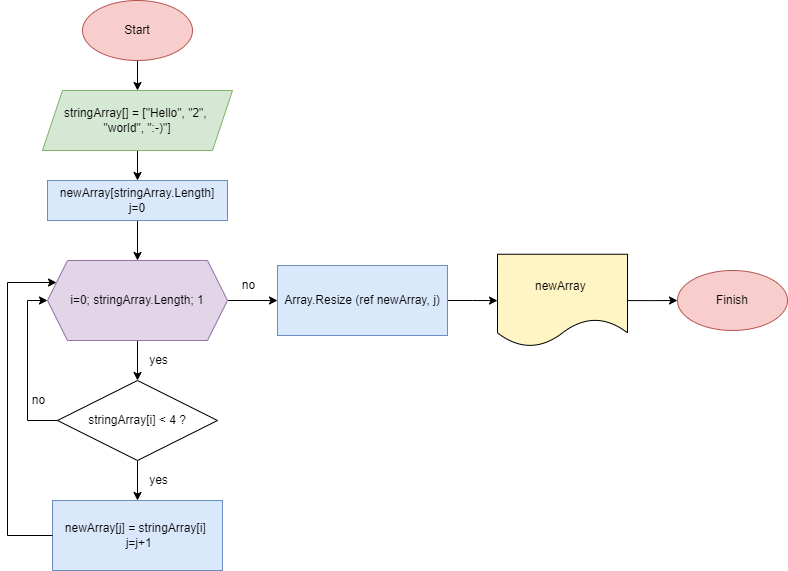

# Описание решения задачи

## Текст задачи:
**Написать программу, которая из имеющегося массива строк формирует новый массив из строк, длина которых меньше, либо равна 3 символам. Первоначальный массив можно ввести с клавиатуры, либо задать на старте выполнения алгоритма. При решении не рекомендуется пользоваться коллекциями, лучше обойтись исключительно массивами.**

## Решение задачи
Для решения поставленной задачи:
* была нарисована блок-схема алгоритма 

* был создан репозиторий на _GitHub_

При решении задачи можно выделить следующие этапы:
1. Создание исходного массива.
2. Создание нового массива по длинне соответсвующего исходному.
3. Заполнение нового массива элементами, длинна которых меньше либо равна 3.
4. Сокращение размера нового массива при помощи команды `Array.Resize`.
5. Печать нового массива.